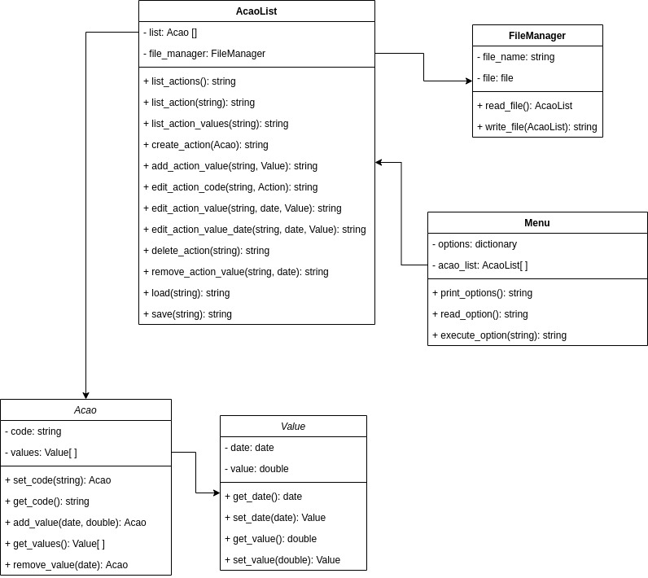

# Variação de Ações

* Ruby
* CLI
* Orientado a Objetos
* testes

Permite o usuário navegar em um menu apertando teclas
Permite o usuário CRUD dados sobre ações em determinada data
inserir datas ( dd/mm/aaaa ) e valores ( 00,00 ) sobre a cotação de um Ação.
Salva os dados em um arquivo local data.json

